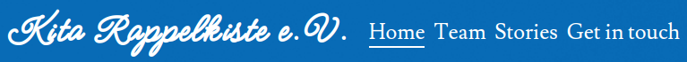
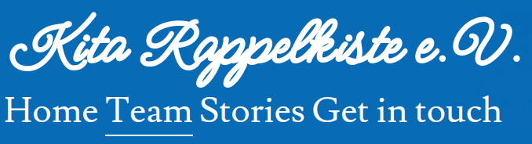
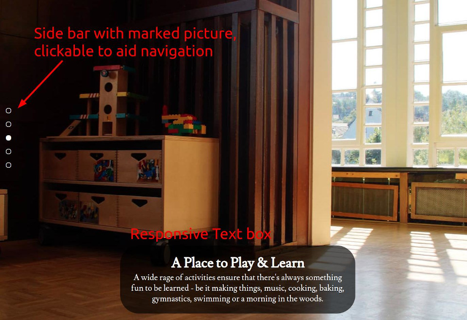
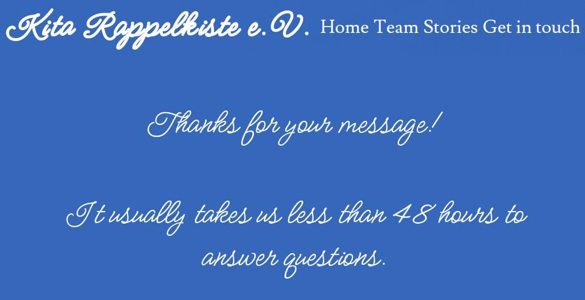
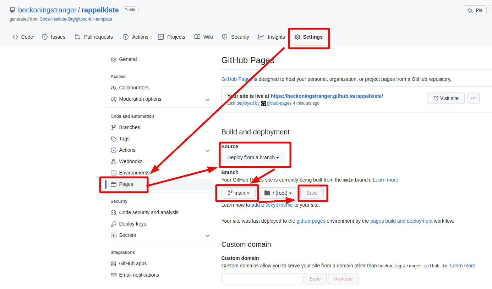
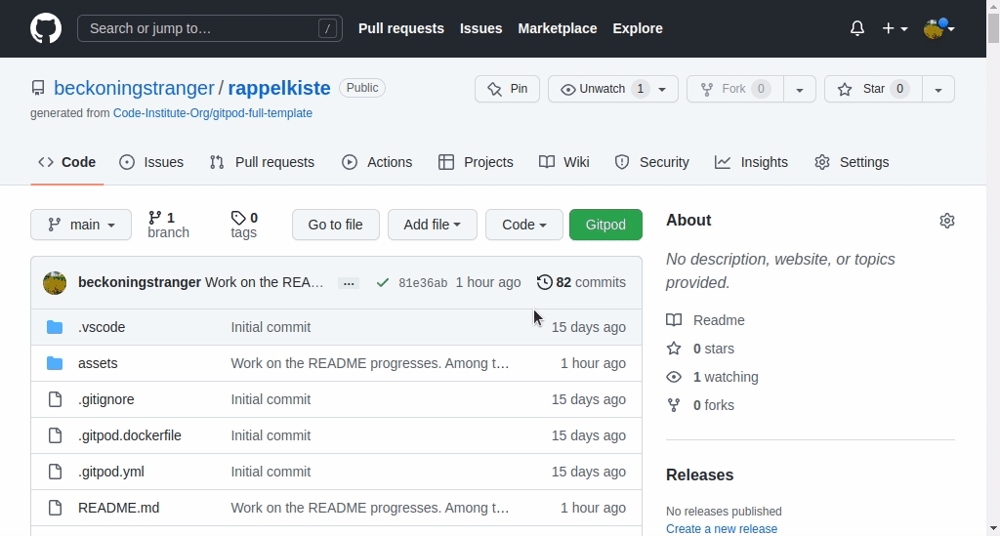
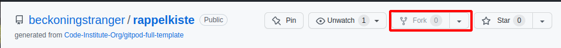
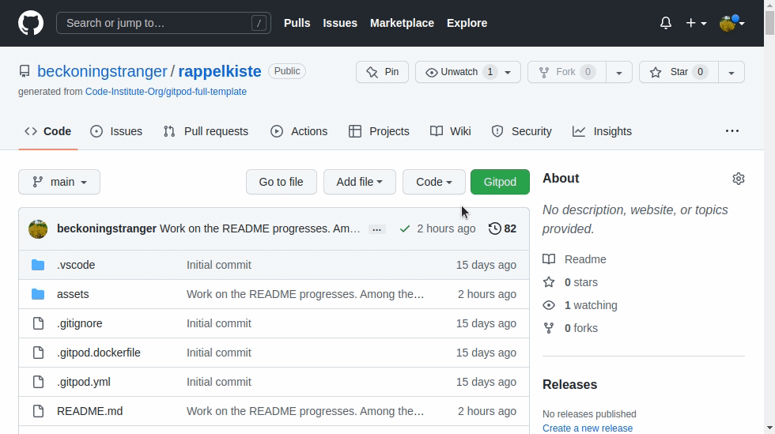

# Kita Rappelkiste e.V.

Kita Rappelkiste e.V. is a site that is aimed at parents who are looking for a day care center for their unborn or newly born child. "Kita" is a German abbreviation for KInderTAgesstätte, basically kindergarten. The German word Rappelkiste could be translated loosely to 'rattlebox', it refers to the house (the box) from which you can hear all kinds of noises (the rattling). "e.V." means "registered association", which is legally relevant and also hints at the fact that this day care center is special in that it was founded and is still run by parents, not the state, a church or any other institution.

Visitors of the site are supposed to get a first impression of what makes this day care center special, i.e. is the picturesque building, the interior's cozy atmosphere, the friendly teachers, the fact that it has an above average sized team and that the teachers have lots of interesting activities and projects in store for the children which parents can read about in the Stories section. Users can then use the Get in Touch page or click the telephone/email links to contact the day care center.

Take a look at the deployed website: <a href="https://beckoningstranger.github.io/rappelkiste/index.html" target="_blank" rel="noopener">Rappelkiste</a>.

# Contents

* [**User Experience UX**](#user-experience-ux)
  * [User Stories](#user-stories)
    * [Client Goals](#client-goals)
    * [First Time Visitor Goals](#first-time-visitor-goals)
    * [Returning Visitor Goals](#returning-visitor-goals)
  * [Design](#design) 
    * [Site Structure](#site-structure)
    * [Color Scheme](#color-scheme)
    * [Typography](#typography)
    * [Wireframes](#wireframes)
* [Features](#features)
  * [Existing Features](#existing-features)
    * [Navigation Menu](#navigation-menu)
    * [Home Page: Picture Gallery with text boxes and full page scrolling](#home-page-picture-gallery-with-text-boxes-and-full-page-scrolling)
    * [Footer](#footer)
    * [Team Page](#team-page)
    * [Stories Page](#stories-page)
    * [Get in Touch Page](#get-in-touch-page)
    * [Thank You Page](#thank-you-page)
    * [Future Implementations](#future-implementations)
      * [Teachers Section](#teachers-section)
      * [Members Section](#members-section)
      * [Updated Team Page](#updated-team-page)
      * [Swipe actions](#swipe-actions)
  * [Accessibility](#accessibility)
* [Technologies Used](#technologies-used)
  * [Languages Used](#languages-used)
  * [Frameworks, Libraries & Programs Used](#frameworks-libraries--programs-used)
* [Testing](#testing)
* [Deployment](#deployment)
  * [How to Deploy the Project on GitHub Pages](#how-to-deploy-the-project-on-github-pages)
  * [How to Fork the Repository on GitHub](#how-to-fork-the-repository-on-github)
  * [How to Clone the Repository on GitHub](#how-to-clone-the-repository-on-github)
* [Credits](#credits)
  * [Content](#content)
  * [Media](#media)
* [Acknowledgements](#acknowledgements)

# User Experience UX

## User Stories

### Client Goals

* As the manager of the Rappelkiste I want a way to attract new parents that may visit the site on a wide range of differently sized devices so that I will have a steady flow of applications.

* As the manager of the Rappelkiste I want the site to act as a calling card that gives my audience a good impression of the day care center and its team, so that they build confidence and trust with the day care center and its team.

* As a teacher I want to showcase projects that the teaching team has done with the children so that the audience can further build confidence/trust in the team's work.

* As the manager I want to give people an easy way to get in touch, be it via telephone, email or a contact form so that the team can built a relation with them and their questions get answered.

[Back to top](<#contents>)

### First Time Visitor Goals

* As a parent who is looking for a day care center for my child, I want to build trust with a day care center where my child will potentially spend most of their day so that I can send them there without having second thoughts.

* As a parent who is looking for a day care center for my child, I want to learn what sets the Rappelkiste apart so that I know my child can grow in a safe and stimulating place.

* As a parent who is looking for a day care center for my child, I want to learn what the facilities look like and get a vibe of the atmosphere so that I can be sure they are taken care of and will be happy there.

* As a parent who is looking for a day care center for my child, I want to learn about who will look after my child and what background they have so that I can trust they are in good hands.

* As a parent who is looking for a day care center for my child I want to learn about special activities the teachers planned for the children so that my child will have fun and constantly learn new things.

* As a parent who is looking for a day care center for my child, I want a quick way of figuring out how far the day care center is from my home so that I can estimate how much effort will go into getting them there.

[Back to top](<#contents>)

### Returning Visitor Goals

* As a parent whose kids already attend the day care center, I want to read and learn more about activities that my child talked about after coming home, but couldn't explain fully, so that I know what my child is excited about and can take part in their life.

* As somebody who wants to get in touch with the day care center I want an easy way of calling, writing an email or otherwise contacting somebody, be it to plan a personal visit as an interested parent, to phone in to coordinate with the teachers for parents whose child already attends, or as somebody looking for an internship, just as a few examples so that there is no hurdle to get in touch.

* As a parent who has made an appointment for a personal visit, I want an easy way to navigate to the day care center so that I can plan accordingly.

[Back to top](<#contents>)

# Design

## Site Structure

The website consists of four main pages and a thank you page. The [Home page](index.html) is the landing page, while the [Team page](team.html), the [Stories](stories.html) and the [Get in Touch](contact.html) page are accessible via the top menu. Once the user successfully submits a message on the [Get in Touch page](contact.html), they are taken to a simple [Thank You page](thankyou.html), from where they can navigate anywhere they want via the top menu.

[Back to top](<#contents>)

## Color Scheme

The color True Blue (#3567BB) was taken from the hero image that you see when you first visit the site, the darker blues were picked to create nice looking gradients that ensured contrast to keep the overlaid white text easy to read. The True Blue that's also present on every site in the header will hopefully set the mood for the entire page, as it is associated with good weather, sunshine and all the feelings that are associated with that.
On the Team page, where the larger font size makes the text easier to read, I have picked a True Blue (#3567BB) to Dark Cornflower Blue (#19366D) gradient, on the Stories page, where the font size is significantly smaller and there's also just more text I have picked a Dark Cornflower Blue (#19366D) to Oxford Blue (#0A214B) gradient.
The Marigold Orange (#F3A712) was picked because it can highlight elements clearly. As orange is a complementary color for blue, they work nicely together.

[Back to top](<#contents>)

## Typography

Google Fonts was used for the following fonts:

- Lusitana is used for headings and body text of the site. It is a serif font that is still very easy to read.

- Meow Script is a monoline font that adds character to the site's logo.

[Back to top](<#contents>)

## Wireframes

At the outset of this project, the design of the website was desktop first, which is why the emphasis was on creating wireframes for this size format. This later changed, but all designs found their way into the final website except for the Contat page which was redesigned at a late stage of development.

As this was my first foray into designing, I had to adapt when I found that the initial design would not work or could be improved. The most significant of these changes was the contact page where I found that the two-column design with the clearly defined border in the middle would not be practical, even on larger screens as the picture would often be cut off or the two columns would not be of equal length, breaking the design. I eventually opted for a screen filling background picture with an overlaid box for the text and form.

The initial Team page design was realized for mid-sized screens, i.e. larger phones in landscape mode and tablets with viewport widths greater than 540px but smaller than 1200px. For smaller viewports I decided on a one-column design and for viewports over 1200px in width I found a completely new design that presents the team as a whole in one line with a text box under the pictures with changing text, depending on which picture the user taps/hovers. 

[Back to top](<#contents>)

# Features

## Existing Features

### __Navigation Menu__

  - The navigation menu lets users access the four main pages of the website. It is responsive and displayed in two rows for viewport widths lower than 768px. In wider viewports, all of the content is fit into one row. 
  - Users on devices with attached pointing devices will see a hovering effect that underlines the menu items they hover over, except on the logo.
  - The page the users are on is displayed as underlined.
  - The logo is also clickable and will show the Home page if clicked.

  
  

[Back to top](<#contents>)

### __Home page: Picture Gallery with text boxes and full page scrolling__

  - On the Home page, the background pictures cover 80% or 90% of the viewport height per section, depending of device orientation, resulting in a view where the navigation menu covers the top 10-20% and the background picture the rest of the screen. This puts the pictures front and center, with no distrations. Naturally, the pictures look better the larger the viewport is, but I have created 3 picture sizes that are applied depending on the viewport width:

    - For phones, a 1024x1024px sized picture, so that users can also use their phone in landscape mode without the picture being cut off.
    - For tables and small laptops, a 1368x1368px sized picture. This specific size was chosen because of the Surface Pro 7 that has this exact width in landscape mode. The iPad Pro has a width of 1366px, which is very similar.
    - For wider viewports, a picture with a width of 2160px is used.

  All pictures are centered on both axes, except for the hero image where I wanted to avoid the gable of the house being cut off.

  - For each pictures, there is an overlaid text box, that provides additional information for users. This way, users get a good idea of the facilities and values that underpin the day to day life of the day care center. The text box is most located at the bottom center, expect when that would block an element of the photo that I wanted to be in clear view. In these cases, the text box was moved to the top center. These text boxes are also fully responsive and adapt to the viewport width and whether the device is in portrait or landscape mode. A lot of testing went into this, more on this in the [Testing Section](TESTING.md).
  To ensure that the text is easily to read, the overlay text box is semi-transparent, giving enough contrast against the background picture.

  - A side bar with 5 dots, one for each section, gives the user an idea of the amount of sections he can see as well as a means to navigate to each section easily. Using this bar also has the advantage that each picture will be nicely aligned with the viewport edges. This sidebar is positioned at center left and will show a slight hover effect for users using pointing devices.

  

[Back to top](<#contents>)  

### __Footer__

  - The footer contains three links. One to easily place a call to the day care center, one to email them and one that will take you to Google Maps in case you want to see where the day care center is located or you want to navigate to it.

  

[Back to top](<#contents>)

### __Team Page__

  - The Team page is fully responsive and will display in three different layouts, depending on viewport size. For viewports below 540px width, there's a one column view, for viewports below 1200px a two column view and for viewports of 1200px and above a third layout, where all of the team members are display side by side and users have to click them to read their descriptions. Even though I like this design, it's probably the poorest UX of all the ones present here, because users will find the page with an empty text box before they tap/hover a picture. I intend to change this once I learn about JavaScript, so that the user will find the page with a photo preselected and the text box at the bottom filled. Unfortunately there does not seem to be a way to do this with pure HTML/CSS, I did quite a bit of research and also eventually consulted the tutor team, with no results.
  - The Team page will give users an idea of who will look after their children and what background they have, the aim is to build trust.

  
  
  

[Back to top](<#contents>)

### __Stories Page__

  - The Stories page is also fully responsive, with a one column layout for viewports widths below 1200px and a two column layout for viewports above 1200px width. Where photo and viewport width allow, photos will be displayed next to each other to fit more content on the screen. On this page, users can read more about the team's work, recent events and projects the children did and anything else the teachers might choose to blog about. All of this serves to build trust in the day care center and its team's work.
  
  
  

[Back to top](<#contents>)

### __Get in Touch Page__

  - The Get in Touch page is displayed with a one column layout for view for viewports below 1200px of width and a background page with an overlaid box on the left hand side for wider viewports. Here, users have another easy way to get in touch with the day care center. Upon submitting the form, users are taken to a simple Thank You page.

  
  

[Back to top](<#contents>)

### __Thank You Page__
  
  - From this simple page, user can navigate back to where they want, as the navigation menu at the top is shown as on all other sites. This just serves as feedback that their message was processed.

  

[Back to top](<#contents>)

## Future Implementations

### Teachers Section
  -  An teacher section that allows teachers to
    - publish more articles on the Stories page.
    - post announcements for all current parents. Polls are another idea.

### Members Section
  - A members section where parents can read the announcements that teachers have previously posted (cf. idea above)

### Updated Team page
  - An update to the Team page layout visible with viewports wider than 1200px so that when users come to it, a teacher is pre-selected.

### Swipe actions

  - Swipe actions on mobile devices to let users navigate from page to page, giving it the feel of an app.

[Back to top](<#contents>)

## Accessibility

I have tried to keep with website as accessible as possible by using semantic HTML elements, providing adequate contrast for my fonts, which are sometimes displayed over images, especially on the Home and Get in Touch page, using the alt attribute for images, the title attribute for links, etc. To further ensure that the site is accessible I ran tests with the Web Accessibility Evaluation Tool (WAVE) and also used a Chrome browser extension called Web Disability Simulator. More on this in [Testing](#testing).

[Back to top](<#contents>)

# Technologies Used

## Languages Used

HTML5 & CSS3

## Frameworks, Libraries & Programs Used

* [Figma](https://figma.com) - For creating designs and experimenting with page layouts

* [Git](https://git-scm.com/) - For version control

* [GitHub](https://github.com) - To save and store my project files

* [Google Fonts](https://fonts.google.com/) - To find and import fonts

* [Font Awesome](https://fontawesome.com/) - To build the full page scrolling navbar and additional iconography

* [Google Dev Tools](https://developer.chrome.com/docs/devtools/) - To work out bugs, troubleshoot and test features and play around with property values. Also to test the website using the Lighthouse Test.

* [Compressor.io](https://compressor.io) - To compress images

* [GIMP](https://gimp.org) - To resize and convert images and to make the skies on the images I used one coherent color so that there is no visible transition to the header

* [Favicon.io](https://favicon.io/) - To create a favicon

* [Am I Responsive?](https://ui.dev/amiresponsive) - To showcase the website on all of the images used in this documentation file

* [Web Disability Simulator](https://chrome.google.com/webstore/detail/web-disability-simulator/olioanlbgbpmdlgjnnampnnlohigkjla) - To ensure accessibility for all users

* [WAVE Web Accessibility Evaluation Tool](https://wave.webaim.org/) - To further ensure accessibility for all users

* [Google Translate](https://translate.google.com) - To translate some of the content from German to English

[Back to top](<#contents>)

# Testing

Please go [here](TESTING.md) for information about the testing that went into this project.

[Back to top](<#contents>)

# Deployment

## How to Deploy the Project on GitHub Pages

1. In your browser, navigate to the [GitHub page of this project.](https://github.com/beckoningstranger/rappelkiste)

2. Click on the 'Settings' button in the top menu
3. Select the 'Pages' section in the side bar on the left
4. Under 'Source' select 'Deploy from a branch'
5. Select the 'main' branch
6. Click 'Save'
7. After about a minute, when you come back to the page, you will see the message 'Your site is live ...' with a link you can simply click.

[Back to top](<#contents>)

## How to Fork the Repository on GitHub

1. In your browser, navigate to the [GitHub page of this project.](https://github.com/beckoningstranger/rappelkiste)
2. Click the 'Fork' button at the top right of the page. If you are not the owner of the project, it will not appear greyed out to you:

[Back to top](<#contents>)

## How to Clone the Repository on GitHub

1. In your browser, navigate to the [GitHub page of this project.](https://github.com/beckoningstranger/rappelkiste)
2. Click the 'Code' button, make sure you have HTTPS selected and then click the button to copy the link to your clipboard as demonstrated in this GIF:

  

3. Open your IDE and either use the functionality it provides (many IDE offer buttons that help you clone repositories) and paste your link there to have your clone created or go to the terminal and type: 'git clone \[insert your link here\]'
4. Hit ENTER and wait for you local clone to be created.

[Back to top](<#contents>)

# Credits

## Content

All of the content on the Home Page was written by myself, except for the heading 'Your child is unique - so are we', which was written by the Rappelkiste's team and only translated from the German 'Ihr Kind ist einzigartig - wir sind es auch'. This can be found on [their current live website](https://www.rappelkiste-siegen.de), specifically [here](https://www.rappelkiste-siegen.de/wer-wir-sind/).

The Team Page and Stories page content was also written by the Rappelkiste's team and then translated by Google Translate. All of the content used is used with express permission from the team.

All of the other content is original and written by the me.

[Back to top](<#contents>)

## Media

All photos on the page were taken by the Rappelkiste's team and are used with express permission by them. There are only three exceptions to this:

  1. The hero image was taken by myself.
  2. The image for the 'Out and About' section of the Home page. This was taken from Pexels, specifically [cottonbro](https://www.pexels.com/photo/a-boy-hiding-behind-the-wooden-sticks-6034408/).
  3. The image of the police car in the article [Mr Röcher, the policeman comes to visit!](https://beckoningstranger.github.io/rappelkiste/stories.html) on the Stories page. I found it on [Pexels](https://www.pexels.com/photo/a-photo-of-a-police-car-3671134/), it was taken by Markus Spiske.

[Back to top](<#contents>)

# Acknowledgements

I would like to thank the following people

* Precious Ijege, my mentor, for providing feedback on my ideas and helping me create this project.

* Kera Cudmore, for her class on how to write a README and her insight she offered when I contacted her on Slack.

* The Code Institute tutor team, especially for making me aware of flexbox, which solved so many problems for my page layout.

* My family, for bearing with me when I dealt with time pressure and frustration.

[Back to top](<#contents>)