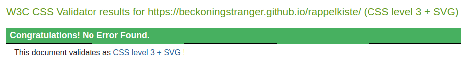

# Testing

## Validator Testing

### HTML and CSS

To test compliance with HTML standards, the [W3C Markup Validation Service](https://validator.w3.org/) was used. Here are the results for all files:

 
 
 
![contact.html]/assets/documentation-images/code-validation-contact.png) 

### Lighthouse Test

### WAVE

## Unfixed Bugs